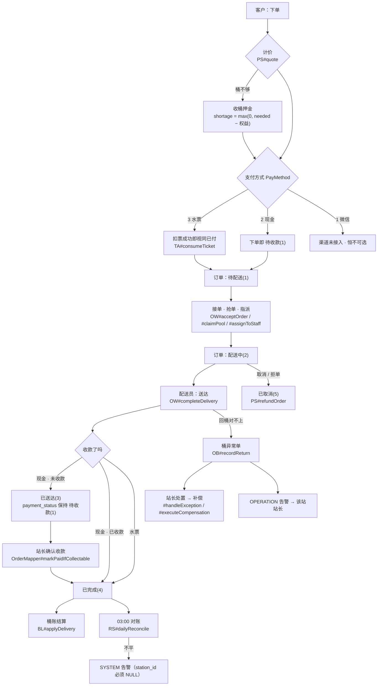
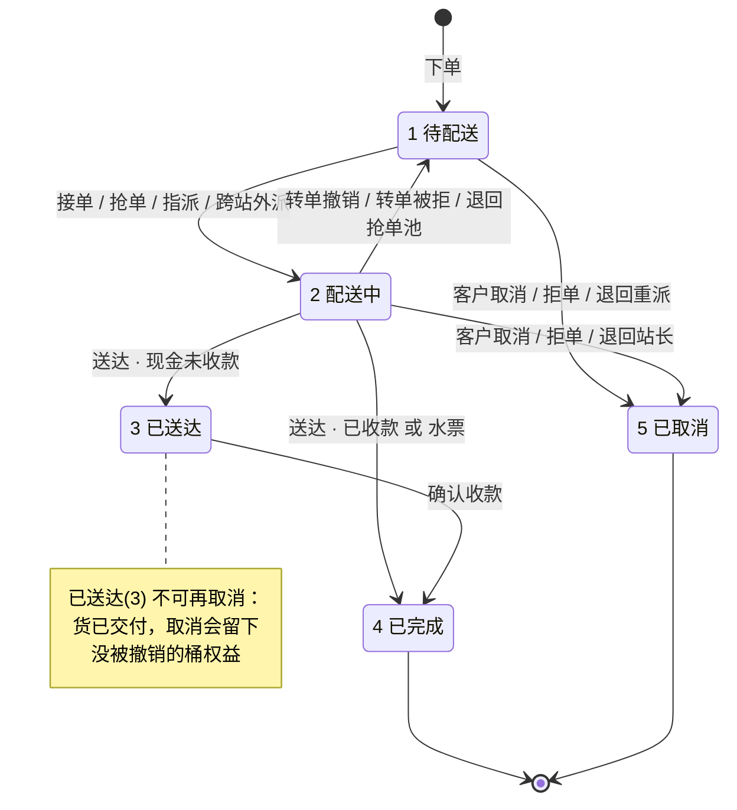
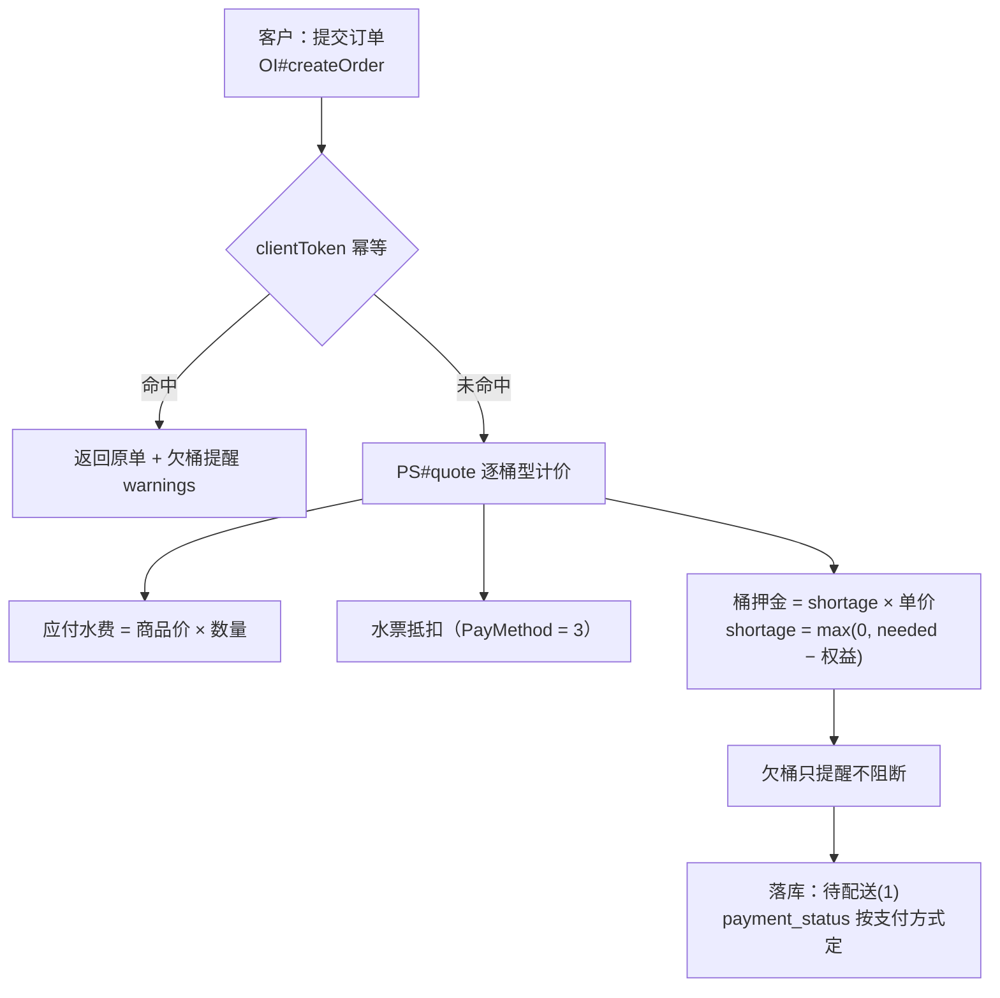
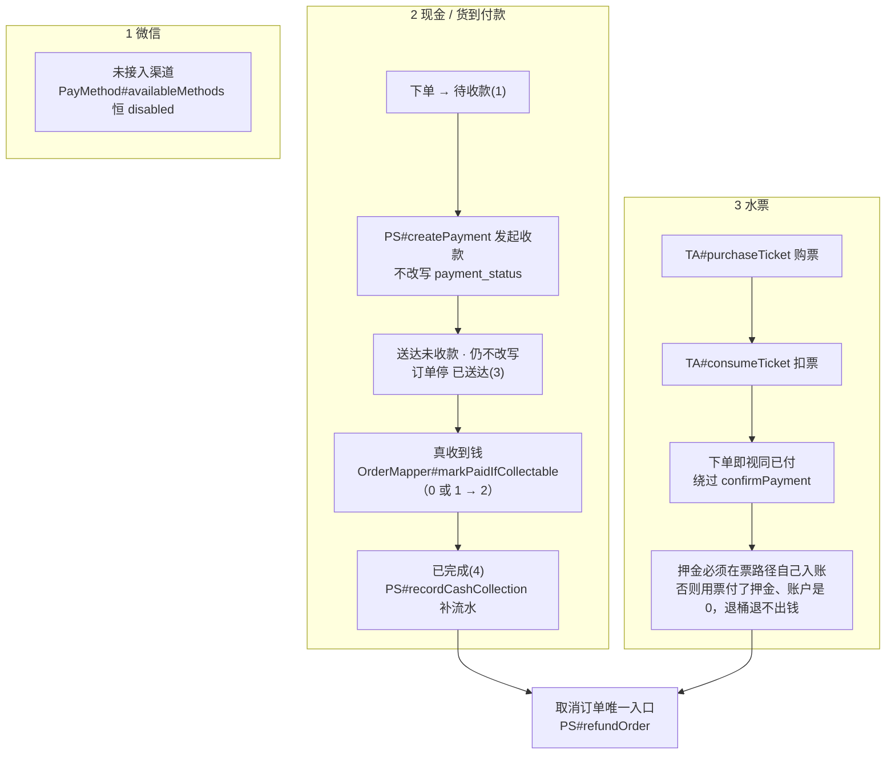
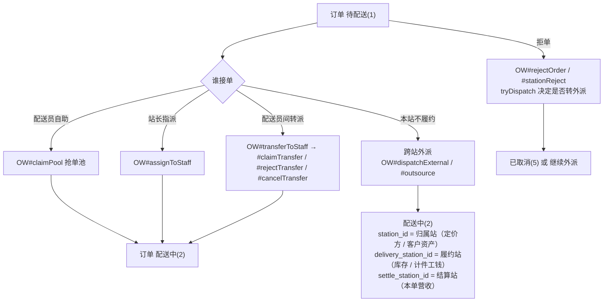
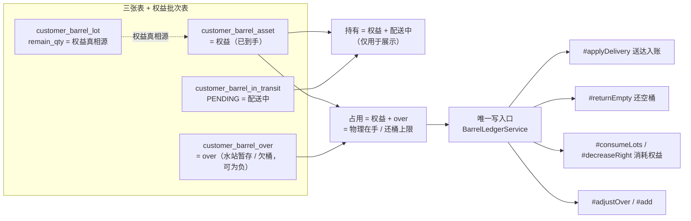
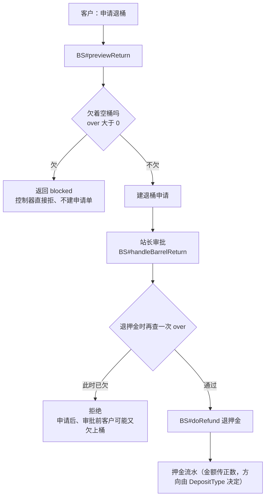
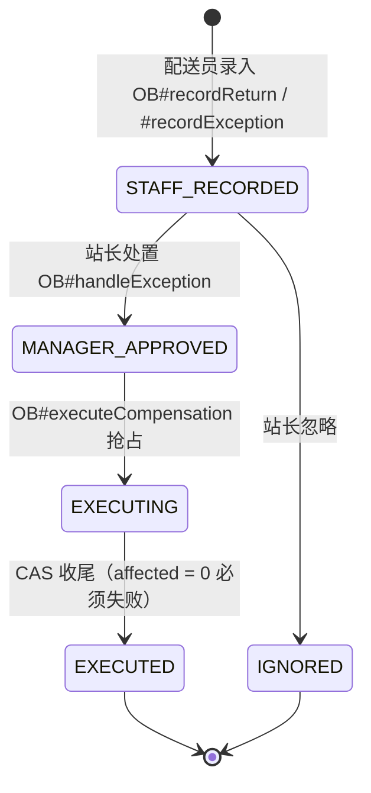
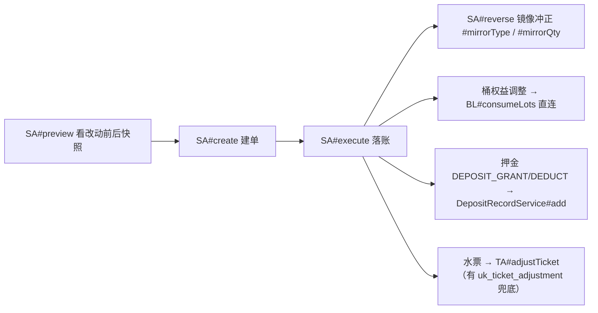
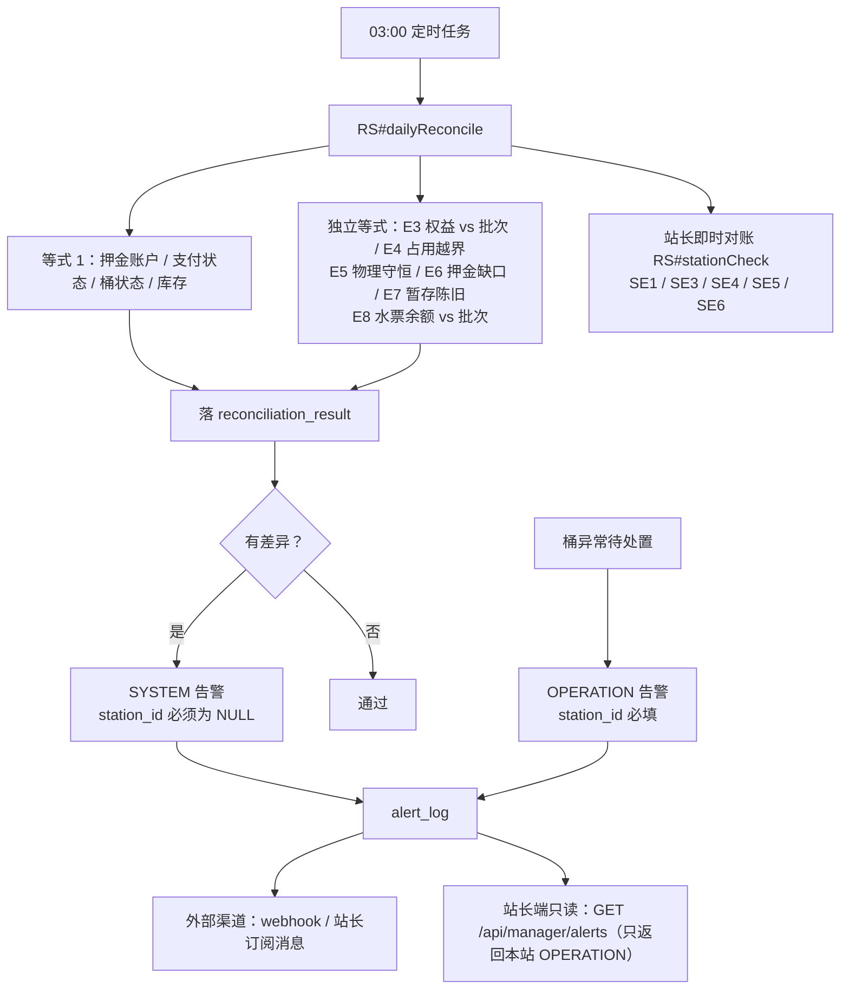

# 15 · 业务流程地图

> **文档头**
>
> | 项 | 值 |
> |---|---|
> | 文档名 | 业务流程地图 |
> | 状态 | 已实施 |
> | 适用对象 | 后端 / 站长端 / 顾客端 / 配送员端 |
> | 关联代码 | `constant/OrderStatus`、`constant/PayMethod`、`constant/PaymentStatus`、`constant/AlertType`、`service/impl/OrderWorkflowServiceImpl`、`service/impl/PaymentServiceImpl`、`service/BarrelLedgerService`、`service/impl/OrderBarrelExceptionServiceImpl`、`service/impl/StationAdjustmentServiceImpl`、`service/ReconciliationService`、`util/StationUtil` |
> | 关联迁移 | `sql/migration_v47_order_settle_station.sql`（执行证据见 `sql/README.md`） |
> | 上位文档 | [AGENTS.md](../../AGENTS.md) §1、[02-领域模型.md](../architecture/02-领域模型.md) |
> | 下位文档 | 无 |

## 1. 目的与范围

本文回答：一单水从下单到回桶、钱到账、账对平，中间经过谁、状态怎么走、**钱 / 水票 / 桶**分别在什么时候动。

**范围内**：状态流转、送达时钱货是否同步、三站（归属站 / 履约站 / 结算站）的钱货去向、桶账四数与退桶闸门、桶异常闭环、资产调整单、对账与告警分级、三条账线的落点时刻、角色 × 流程权限。**范围外**：文件级调用关系（用 `code_map` / `code_refs`，见 [AGENTS.md](../../AGENTS.md) §11）；领域口径的**定义**——正本是 [AGENTS.md](../../AGENTS.md) §1 与 `constant/*.java`，本文只画「经过谁、先后顺序」。

**图的读法**：mermaid 编写。每个节点都标代码入口，一律写作 `类#方法`，**刻意不写行号**——行号随代码漂移，写死比不写更危险；**图与代码冲突时以代码为准并回来改图**。图内缩写（首次出现即定义）：`OW` = `service/impl/OrderWorkflowServiceImpl`，`PS` = `service/impl/PaymentServiceImpl`，`OI` = `service/impl/OrderServiceImpl`，`BL` = `service/BarrelLedgerService`，`OB` = `service/impl/OrderBarrelExceptionServiceImpl`，`TA` = `service/impl/TicketAccountServiceImpl`，`SA` = `service/impl/StationAdjustmentServiceImpl`，`RS` = `service/ReconciliationService`，`BS` = `service/impl/BarrelServiceImpl`。

---

## 2. 一屏总览：主干流程

主干只有这几种落点：**待配送(1) / 配送中(2) 可走向已取消(5)；已送达(3) 只能走向已完成(4)；已完成(4) 与已取消(5) 是终态。**

---

## 3. 订单状态机（唯一真相：`constant/OrderStatus`）

| 从 → 到 | 谁触发（代码入口） |
|---|---|
| 1 → 2 | `OW#acceptOrder`、`#claimPool`、`#assignToStaff`、`#transferToStaff`、`#claimTransfer`、`#outsource`、`#dispatchExternal` |
| 1/2 → 5 | `OW#rejectOrder`、`#stationReject`、`#requestCancelByCustomer`、`#requestCancelByStaff` → `#cancelWithRefund` |
| 2 → 3 | `OW#completeDelivery` → 现金单未收款分支 |
| 2 → 4 | `OW#completeDelivery` → 已收款 或 水票分支 |
| 3 → 4 | `PS#confirmOrderCollection`、`OW#confirmOfflinePay` |
| 2 → 1 | `OW#cancelTransfer`、`#rejectTransfer`、`#outsource`（退回流） |

- 非法流转由 `OrderStatus#isValidTransition` 拒绝；**`isCancellable` 只放行 待配送(1) / 配送中(2)**，故**已送达(3) 不可取消**。理由：权益批次在送达那一刻已建（`BL#applyDelivery`），而取消链 `PS#refundOrder` 的桶账处理整块罩在「状态 < 已送达」之下、够不着它——取消一张已送达单会留下**没被撤销的桶权益**（客户手上是可退押金的权益，而那笔押金从未收到）。改法：客户拒付走「配送异常」（`order_barrel_exception`）；已完成的退款走 `PS#refundPayment`（只退这一笔钱，不取消订单）。
- **状态机与闸门必须同时改**：若 `isValidTransition` 说「合法」而 `isCancellable` 说「不许」，下一个改代码的人会照着状态机写。
- 状态文案唯一来源 `OrderStatus#textOf`，**前端禁止自带 1/2/3 映射表**。用例 `DeliveryCompleteIntegrationTest`。

---

## 4. ★ 送达时「钱货是否同步」的判定表

`OW#completeDelivery` 决定订单停在 3 还是闭环到 4：

| 支付方式 | 送达时收到钱？ | 订单终态 | `payment_status` | 预收押金入账 |
|---|---|---|---|---|
| 现金(2) | 已收款，或配送员点「已收款」 | **已完成(4)** | → 已付(2) | 是 |
| 现金(2) | 送达但没收钱 | **已送达(3)** | **保持 待收款(1)，绝不倒回 0** | 否（确认收款后才入账） |
| 水票(3) | 下单即视同已付 | **已完成(4)** | → 已付(2) | 是 |
| 微信(1) | 渠道未接入，不可选 | — | — | — |

- **送达未收款时不得改写 `payment_status`**：现金单下单即 `待收款(1)`，「送到门口、钱还没收」本身就是待收款；写成 `未付(0)` 会让这笔应收从站长「待收款」合计（`DashboardMapper`：`payment_status = 1 且未取消`）里消失，站长看不到该催谁。唯一写「已付」的入口是 `OrderMapper#markPaidIfCollectable`（从 0 或 1 迁入，**绝不复活 3/4**）。
- **跨站外派单的钱认结算站**：确认收款与退款统一由结算站执行（`StationUtil#settleStation`、`PaymentController#requireRefundStation`，未外派时结算站 = 归属站）；`OW#completeDelivery` 的已收款分支与 `#confirmOfflinePay` 判据一致。用例 `DeliveryCompleteIntegrationTest` 反向断言「归属站确认被拒、履约站（= 结算站）确认闭环」。
- **订单最终为已付款时入账预收桶押金**：`PS#applyDepositOnPaid` 按 `related_order_id` 去重，重复调用安全。
- 跨站单请求体里的 `collected` / `note` 会被**静默丢弃**——裸 `Map` 收敛成 DTO 时 Jackson 忽略未知字段，后果是点「已收款」被当作未收款、钱不入账；改 DTO 必须逐字段核对调用点并补走 HTTP 的用例（`aquaflow-known-traps` §8.15）。

---

## 5. 下单、计价与首单口径

- **幂等先行**：先按 `clientToken` 查，命中就直接返回原单，**并照样下发欠桶提醒**；**计价由服务端推导**（`PS#quote`），客户端传的金额一律不可信。
- **桶抵扣与退押金只认「权益」**：`shortage = max(0, needed − 权益)`，逐桶型（A 水的多不能抵 B 水的欠）；**配送中的桶不参与抵扣、也不可退**——那批桶还没到手上。
- **欠桶只提醒、不阻断**：物理护栏始终是 `占用 = 权益 + over ≥ 0`；已移除的 `MAX_OWED_BUCKETS = 5` 硬拦**不要再加回**。
- **费用绝不并入 `water_amount` 或 `deposit_amount`**（后者可退，混入会导致取消时多退钱），各自成列；报价与下单必须调同一个 `DeliveryFeeService#calcForOrder`、传同样口径，否则重演「计价双轨」。
- **首单是两处口径的合称**：`OI#createOrder` 写 `orders.first_barrel_order`（本站第一笔**买桶**订单）；`OW#completeDelivery` 读它，为真则**整段跳过回桶核对**——客户刚买下桶、手上没空桶可还，回桶填 0 **不得**生成桶异常单。押金口径同源（首单权益 0 → 收满）。用例 `OrderEntryAndInjectionIntegrationTest`；**查写入点必须连 XML mapper 一起查**。

---

## 6. 支付与收款（三条支付线的全部差异）

- **支付状态只前进、不倒滚**：`0 未付 / 1 待收款 / 2 已付 / 3 已退款 / 4 已取消`（正本 `constant/PaymentStatus`，唯一真值是 `orders.payment_status`）。
- **禁止**写 `updatePaymentStatusIf(..., UNPAID, PAID)`——现金单现值是 1，CAS 的 `expected = 0` 恒不命中：**钱收了、单子永远停在待收款**；未收款时不要动 `payment_status`。
- **收款必须两步**：先 `PS#recordCashCollection(orderId, note)`（幂等）再 `OrderMapper#markPaidIfCollectable`；**不许另写「补流水」实现**——只置 `payment_status = 2` 而不补 PAID 流水会让对账等式 `p2a` 每核销一单就报不平，表现为**日结永远不平**。
- **CAS 参数顺序靠名字区分，不看注释**：`updateStatusIf(id, 期望, 新)`（`OrderMapper` / `OrderBarrelExceptionMapper`）与 **`updateStatusTo(id, 新, 期望)`**（`PaymentRecordMapper` / `StaffPayrollMapper`）。后者历史上也叫 `updateStatusIf` 而顺序相反，本仓因此在这一点上**静默失败过**；传反恒命中 0 行、不报错、什么都不改。
- **微信渠道未接入**：本地只有模拟渠道（`app.payment.mock-wechat-pay`，生产关闭），它是**新客户第一单的唯一自助通道**；**未接入时不许假装已退**——手工退款直接拒，取消链不阻断但要在 `note` 写明需线下退款。
- **退款只有两个入口，都必须原路径返回**：取消订单 → `PS#refundOrder`（门槛 `OrderStatus#isCancellable`）；只退这一笔钱 → `PS#refundPayment`（不取消订单）。两条路径共用 `insertRefundRecord` / `restoreTicketsForOrder`；水票回补 `ticket_lot` 批次、现金记负金额冲正流水，漏一条对账 E8 就平不了。

---

## 7. 派单与履约（三站语义：归属站 / 履约站 / 结算站）

- **铁律**：`orders.station_id` = **归属站（定价方 / 客户资产）**，`orders.delivery_station_id` = **履约站（库存 / 计件工钱）**，`orders.settle_station_id` = **结算站（本单营收：水费 + 配送费 + 楼层费）**。取值：下单 = 归属站；抢单 / 定向外派成功后 = 履约站；召回 / 退回池 / 指定退回-同意 = 回归属站；唯一实现 `StationUtil#settleStation`。
- **钱认结算站**：看板、毛利报表（成本 join 也按结算站）、应收账款与核销、确认收款判权、退款判权、`payment_record.station_id` 写入。**SQL 读取一律 `coalesce(o.settle_station_id, o.delivery_station_id, o.station_id)`**，末级是防御，正常写入必须落 `settle_station_id`。**客户资产认归属站**：押金账户 / 水票 / 桶权益一律不动；跨站单取消 / 召回时「库存回补记履约站、押金与水票回归属站」——**钱跟送货的站走、客户资产留在买账的站，是刻意的分工，不是错位**。
- **抢单池 / 他站外派是跨租户可见面**：下发给别站站长的字段只许带「钱货去向」文案与快照金额（`DeliveryController#feeInfoOf`），不许带归属站的成本 / 库存 / 联系方式，**不许下发客户画像**；**含押金 / 桶权益的单禁止进抢单池**（直接拒）；**定向外派必须双方确认**（外派方先勾知悉风险 → 接收站接单再确认，两处留痕）。认领之后履约站侧的配送员面与站长端「员工画像·当前进行中」只带订单快照，唯一实现 `util/CustomerProfileMask`（只抹 `customerName` / `customerPhone`；Map 形态调用方 SQL **必须显式 as 出** `stationId` / `deliveryStationId`，读不到即静默不抹）。
- **只有收到钱的单才进站长 / 配送员视野**：判据两条——`payment_status = 2`，或 `payment_method = 2`（现金 = 货到付款）；**判据三处必须一致**（两张列表 SQL + 接单 / 分配闸门），防「列表看不到但 id 可编造」。
- **被接单之后这单归接单站管**：归属站只能在还没被接单时召回（`OW#cancelDispatch` 只收 `待配送(1)`，放行 `配送中(2)` 会把状态倒滚、且货已在别站车上）；接单之后拒单 / 解决 / 送达 / 收款一律按**履约站**判权。退回链路：`OW#returnToStation`、`#directedReturn` → `#directedReturnApprove` / `#directedReturnReject`。

---

## 8. 桶账四数模型（桶在系统里怎么流动）

权益 = 已到手（`customer_barrel_asset.quantity`，送达时入账）；配送中 = `in_transit` 的 `PENDING`；持有 = 权益 + 配送中（**仅展示**）；占用 = 权益 + over = **物理在手 / 还桶上限（不含配送中）**。恒等式 `占用 = 权益 + over`。

- **唯一写入口是 `BL`**——别处直接写这三张表 = 绕开桶账。
- **任何「按商品 / 按桶型」的桶汇总必须取 `assets ∪ 配送中(PENDING) ∪ over` 的并集**：`customer_barrel_asset` 只记**已到手**的桶，只遍历它会让「首单还在配送途中」的商品**整行消失**——概览写着「配送中 2」、明细一行都没有，连退桶弹窗都选不到那种桶。
- **还桶上限一律用「占用」，不要用「持有」**——持有含配送中，会多报，提交后被后端以「交回数超过当前持有数」拒绝。

---

## 9. 退桶与退押金（欠桶互斥闸门）

- **「欠着空桶就不许退桶，先还清」**——欠桶 = 客户手上端着比权益更多的桶，此时退押金等于桶在别人手里、担保物也没了；**按商品各算**（A 水的多不能抵 B 水的欠）。硬拦两处：`BS#previewReturn` 返回 blocked（控制器直接拒、不建申请单）与 `BS#doRefund` 再查一次 `over`。**退桶审批两步 `1→2→3`**（2 = 确认收到空桶、3 = 已退押金），**不允许跳步**，界面必须给到「退押金」那一步，否则顾客押金退不出来。用例 `BarrelReturnGuardIntegrationTest`。
- ⚠️ **已知绕开这道校验的两条通道**（只应由站长人工发起、且留调整单 / 异常单痕迹）：`SA` 撤桶权益走 `BL#consumeLots` 直连；`OB` 的异常单撤桶权益同理。**不要给顾客或自动流程开这种口子。**
- **欠桶台账**：`customer_barrel_over.owed_since` 只用于展示、**不参与任何校验**；唯一维护点是 `CustomerBarrelOverMapper#syncOwedSince`（≤0 变 >0 写入、回到 ≤0 清空、已是正数再增加不重置）。站长端只读 `GET /api/manager/owed-barrels`。

---

## 10. 桶异常单闭环与资产调整单

- **状态**：`STAFF_RECORDED 待处理`（配送员回桶时自动生成，或配送员自录）→ `MANAGER_APPROVED / IGNORED`（站长决策，CAS：仅 `STAFF_RECORDED` 可写）→ `EXECUTING → EXECUTED`（补偿执行：退水票 / 退现金）。**分类**：回桶少于应还 → `RETURN_SHORT`；多于应还 → `RETURN_OVER`（正本 `constant/ExceptionCategory`）。
- **一条硬判据**：**「要求了补偿却没执行」也必须失败，不能标成 `EXECUTED`**。退水票分支若调价商品为空，旧实现只 `log.warn` 然后照样推到 `EXECUTED`：站长界面显示「已补偿」、客户水票一张没多。现改为抛 `BusinessException`（事务回滚、退回 `STAFF_RECORDED` 可重试）。**任何「用户以为做成了、账上没动」的分支都算缺陷，宁可失败出声。**

调整单入口 `/api/manager/adjustments`（类级 `@RequireRole("STATION_MANAGER")`）。上线前水站用纸质台账经营，存量客户资产没有别的落点——**它是存量迁移的唯一通道**，别用假订单或直接改余额列代替。

---

## 11. 对账与告警（账怎么对平、出问题通知谁）

| 类型 | `station_id` | 什么算 | 发给谁 |
|---|---|---|---|
| `SYSTEM` | **必须 NULL** | 对账不平、桶异常补偿执行失败、未预期 500 | 系统管理员（站长看不懂也修不了） |
| `OPERATION` | **必填** | 桶异常待处置、补偿已执行、异常被忽略 | 该站站长 |

方向由 `constant/AlertType` 决定，**不靠字符串比较或调用方自觉**。**三条硬约束**：① **先落库再谈渠道**——外部渠道没配时 `notify_status = LOGGED`，「渠道没配」绝不等于「告警不存在」；② 落库走**独立事务**（`REQUIRES_NEW`，且必须经代理调用）——否则业务一回滚告警跟着消失，而告警最常见的触发场景恰恰是业务失败；③ 落库 / 推送失败**绝不连累业务**（只记日志）。

**可见性红线**：系统告警**没有 HTTP 入口**（含平台级细节，漏给站长 = 跨租户 + 越权知情）；运维直接 `select * from alert_log where alert_type = 'SYSTEM' order by id desc limit 50;`。`/api/manager/reconciliation` **只有 `GET /`**，站长只能读本站即时对账，写全平台结果的 `POST /run` 已删除、**不要加回**。

**写对账等式的前置判据**：**先问「这个状态在正常经营里会不会合法出现」，会就不能进差异计数。** 实测三处踩坑都表现为日结永远不平：`p2c` 里 `order_id IS NULL` 不等于孤儿（在线购票无订单），判据要加 `AND p.ticket_qty IS NULL`；`b3a` 里 `customer_barrel_in_transit.status = 'DELIVERED'` 是合法终态，要改成「标了已送达却没有权益批次」。用例 `ReconciliationAfterNewFeaturesIntegrationTest`。

---

## 12. 钱 / 水票 / 桶——三条账线在流程哪一步动

| 流程节点 | 订单状态 | 钱（`payment_record`） | 水票（`ticket_*`） | 桶（桶账三表 + 批次） |
|---|---|---|---|---|
| 下单 | 1 待配送 | 现金：待收款(1) | 水票：扣减（`TA#consumeTicket`） | 建配送中(PENDING)；算押金 |
| 接单 / 外派 | 2 配送中 | 不变 | 不变 | 不变 |
| 送达 · 已收款 | 4 已完成 | PAID 流水 + 押金入账 | — | **配送中 → 权益**（`BL#applyDelivery`） |
| 送达 · 未收款 | 3 已送达 | 保持待收款(1) | — | 同上（权益已入账） |
| 确认收款 | 3 → 4 | PAID 流水 | — | 不变 |
| 还空桶 | — | — | — | `BL#returnEmpty`：权益 −，over + |
| 退桶退押金 | — | 押金退款流水 | — | 权益 −，`BS#doRefund` |
| 回桶对不上 | — | 可能退现金 | 可能退票 | 异常单挂账，站长处置 |
| 取消 / 拒单 | 5 已取消 | 退款（`PS#refundOrder`） | 回补批次 | 库存回补走**履约站** |
| 人工订正 | — | 调整单流水 | `TA#adjustTicket` | `BL#consumeLots` 直连 + 调整单痕迹 |

---

## 13. 角色 × 流程 权限矩阵

| 流程节点 | 客户 | 配送员 | 站长 | 系统管理员 |
|---|---|---|---|---|
| 下单 / 取消申请 | ✅ | — | — | — |
| 地址簿 / 常用模板 / 通知 | ✅ | — | — | — |
| 接单 / 抢单 / 转派 | — | ✅ | ✅ | — |
| 送达 / 回桶录入 / 录异常 | — | ✅ | ✅ | — |
| **确认收款** | — | — | ✅（**跨站单由结算站**，见 §4） | — |
| 退桶审批 / 退押金 | 只能申请 | — | ✅ | — |
| 桶异常处置与补偿 | 只读自己 | 只报 | ✅ | — |
| 资产调整单 | — | — | ✅ | — |
| 对账（即时） | — | — | ✅ 只读本站 | — |
| 对账（全平台）/ 系统告警 | — | — | ❌ 不可见 | ✅ 直连 DB |

权限由 `@RequireRole` + `@RequireStation` 经 AOP 切面统一保护，新增方法自动生效；**跨站校验一律以 `AuthContext` 中服务端刷新的 `stationId` 为准，不信任请求参数**。

---

## 14. 流程节点 ↔ 已知坑 对照（改哪一段先看哪条）

坑条目正本在 skill `aquaflow-known-traps`，编号与原 [AGENTS.md](../../AGENTS.md) §8 一致；表内裸 `§8.N` 指该 skill，带 `AGENTS.md §1` 的指领域不变量。

| 流程节点 | 已知坑 | 条目 |
|---|---|---|
| 送达判定 / 请求体 | 裸 `Map` 收敛成 DTO 时**静默丢字段**（`collected` / `note`） | §8.15 |
| 送达未收款 | `payment_status` 倒回 0 → 应收从站长「待收款」合计消失 | [AGENTS.md](../../AGENTS.md) §1 |
| 确认收款 | `updatePaymentStatusIf(..., UNPAID, PAID)` 恒不命中 | [AGENTS.md](../../AGENTS.md) §1 |
| 任何 CAS 写状态 | `updateStatusTo` 参数是 `(id, 新, 期望)`，写反**静默不变** | [AGENTS.md](../../AGENTS.md) §1 |
| 跨站外派 | 营收认结算站、库存与工钱认履约站、押金 / 水票 / 桶权益认归属站 | [AGENTS.md](../../AGENTS.md) §1.1、§8.3 |
| 取消退款 | 唯一入口 `refundOrder`；**已送达 / 已完成 / 已取消都不可再取消** | [AGENTS.md](../../AGENTS.md) §1、§8.18 |
| 水票下单 | 绕过 `confirmPayment` → 押金必须在票路径自己入账 | §8.4 |
| 按商品聚合桶 | 只遍历 `assets` → 整行消失 | [AGENTS.md](../../AGENTS.md) §1、§8.16 |
| 还桶上限 | 用「持有」而非「占用」→ 多报被拒 | [AGENTS.md](../../AGENTS.md) §1 |
| 退桶 | 欠桶仍然退押金 → 桶在别人手里、担保物也没了 | [AGENTS.md](../../AGENTS.md) §1 |
| 异常单补偿 | 要求了补偿却没执行，仍标 `EXECUTED` | §8.17 |
| 站长看板统计 | `<= 当天` 漏一整天 → 看板停在昨天、显示「无异常」 | §8.19 |
| 地址簿 / 模板 | 按 id 操作不验归属、不看受影响行数 | §8.20 |
| 文件上传 | 外部依赖没配 → 500（应为业务错误 `code = 1`） | §8.21 |
| 对账 / 真实库 | 唯一键漂移 → 测试全绿但真实库报 1062 | §8.12 |

---

## 15. 验收用例

| 用例 | 锁住的判据 |
|---|---|
| `DeliveryCompleteIntegrationTest` | 送达分叉（停 3 还是闭环 4）；跨站单只有结算站能确认收款 |
| `OrderEntryAndInjectionIntegrationTest` | 首单口径：首单整段跳过回桶核对 |
| `BarrelReturnGuardIntegrationTest` | 欠着空桶不许退桶；退押金前二次查 `over` |
| `ReconciliationAfterNewFeaturesIntegrationTest` | 合法业务状态不得计入对账差异 |
| `StaffEarningAndPayrollIntegrationTest` | 计件收益只在 `OW#completeDelivery` 的状态 CAS 成功之后产生 |

---

## 16. 待确认事项

| 待确认内容 | 需要的验证手段 | 影响 |
|---|---|---|
| 对账等式的差异判据是否还有「把合法状态算成差异」的漏网项 | 逐条等式对照 [2026-09-16-场景测试矩阵.md](../audit/2026-09-16-场景测试矩阵.md)，按状态枚举穷举正常经营路径 | 漏一条即每日 03:00 误报，淹没真问题 |
| 状态位端点在并发下是否都检查受影响行数 | 静态扫 `controller/**` 与 `service/impl/**` 的 `updateStatus*` 调用点，配合 `ConcurrencyIntegrationTest` | 缺行数检查 = 静默什么都没改 |
| 微信渠道接入后 §6 三条线的判据变化 | 接入时重跑本节的送达分叉与退款用例 | 影响「未接入时不许假装已退」的红线边界 |

---

## 17. 维护约定

改流程先改图：动 `OrderStatus` 流转、支付口径、桶账口径、告警分级任一处，回来改对应那张图与表。图的每个节点都带 `类#方法` 入口、**不写行号**，冲突以代码为准。新增业务流转时先问它属于哪条账线（钱 / 票 / 桶），再决定挂在 §12 哪一行。本文**不复制领域口径**——口径正本在 [AGENTS.md](../../AGENTS.md) §1 与 `constant/*.java`。
