# 15 · AquaFlow 业务流程地图

> **这份文档回答什么**：一单水从客户下单到回桶、钱到账、账对平，中间经过谁、状态怎么走、**钱 / 水票 / 桶**分别在什么时候动。
> 它不是文件调用图。想看"改这个类会牵动哪些文件"，用 `code_map` / `code_refs`（见根 `AGENTS.md` §11）。
>
> **图的画法**：全部用 mermaid 写（GitHub / VS Code / 多数 Markdown 渲染器直接出图），每张图下面配一段等价的**文字流程**和**代码入口**，
> 终端或纯文本场景读文字即可。**每个节点都标了代码入口（`类#方法:行`），图与代码冲突时以代码为准，并回来改这张图。**
>
> 事实来源：2026-09-17 直接读 `src/**` 核对（`OrderStatus` / `PayMethod` / `PaymentStatus` / `OrderWorkflowServiceImpl` /
> `BarrelLedgerService` / `PaymentServiceImpl` / `ReconciliationService` / `OrderBarrelExceptionServiceImpl`）。
> 领域不变量以根 `AGENTS.md` §1 为准，这里只画流程、不重定义口径。

---

## 0. 一屏总览：主干流程

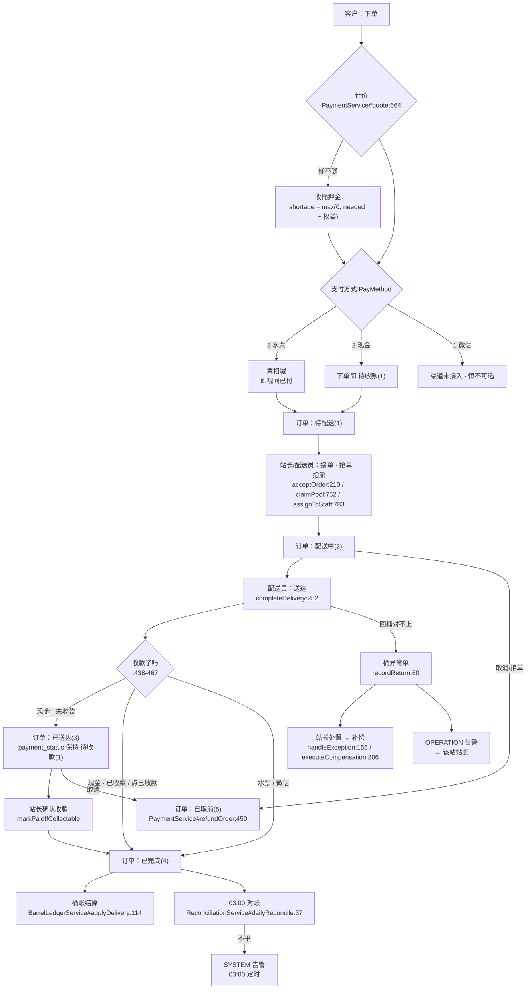
```mermaid
flowchart TD
  C1["客户：下单"] --> P1{"计价<br/>PaymentService#quote:664"}
  P1 -->|"桶不够"| P2["收桶押金<br/>shortage = max(0, needed − 权益)"]
  P1 --> P3{"支付方式 PayMethod"}
  P2 --> P3
  P3 -->|"3 水票"| T1["票扣减<br/>即视同已付"]
  P3 -->|"2 现金"| T2["下单即 待收款(1)"]
  P3 -->|"1 微信"| T3["渠道未接入 · 恒不可选"]

  T1 --> O1["订单：待配送(1)"]
  T2 --> O1
  O1 --> D1["站长/配送员：接单 · 抢单 · 指派<br/>acceptOrder:210 / claimPool:752 / assignToStaff:783"]
  D1 --> O2["订单：配送中(2)"]
  O2 --> D2["配送员：送达<br/>completeDelivery:282"]
  D2 --> P4{"收款了吗<br/>:438-467"}
  P4 -->|"现金 · 未收款"| O3["订单：已送达(3)<br/>payment_status 保持 待收款(1)"]
  P4 -->|"现金 · 已收款 / 点已收款"| O4["订单：已完成(4)"]
  P4 -->|"水票 / 微信"| O4
  O3 --> R1["站长确认收款<br/>markPaidIfCollectable"]
  R1 --> O4
  O4 --> B1["桶账结算<br/>BarrelLedgerService#applyDelivery:114"]
  O2 -->|"取消/拒单"| X1["订单：已取消(5)<br/>PaymentService#refundOrder:450"]
  O3 -->|"取消"| X1
  D2 -->|"回桶对不上"| EX1["桶异常单<br/>recordReturn:60"]
  EX1 --> EX2["站长处置 → 补偿<br/>handleException:155 / executeCompensation:206"]
  O4 --> RC1["03:00 对账<br/>ReconciliationService#dailyReconcile:37"]
  RC1 -->|"不平"| AL1["SYSTEM 告警<br/>03:00 定时"]
  EX1 --> AL2["OPERATION 告警<br/>→ 该站站长"]
```

**文字版（同一条主干）**

```
客户下单
 └─ 计价（quote）
     ├─ 桶不够 → 收桶押金：shortage = max(0, 需要 − 权益)
     └─ 选支付方式：1微信(不可用) / 2现金 / 3水票(视同已付)
 └─ 订单 = 待配送(1)
     └─ 接单/抢单/指派 → 配送中(2)
         ├─ 送达（completeDelivery）
         │   ├─ 现金 + 未收款 → 已送达(3)，payment_status 仍 待收款(1)  ← 等站长确认收款
         │   ├─ 现金 + 已收款 → 已完成(4)
         │   └─ 水票/微信      → 已完成(4)
         ├─ 回桶对不上 → 桶异常单 → 站长处置 → 补偿
         └─ 取消/拒单 → 已取消(5) + refundOrder 退款
     └─ 已完成 → 03:00 对账 → 不平则 SYSTEM 告警
```

---

## 1. 订单状态机（唯一真相：`constant/OrderStatus.java:44`）

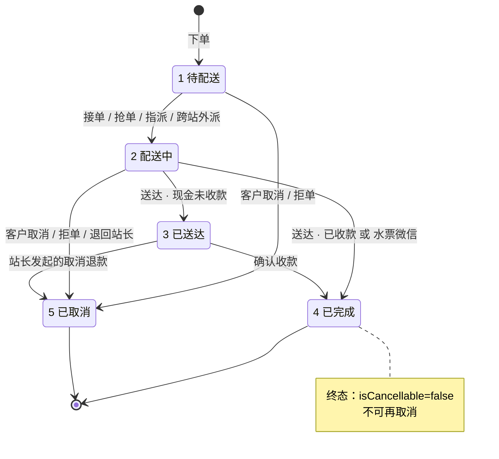
```mermaid
stateDiagram-v2
  state "1 待配送" as S1
  state "2 配送中" as S2
  state "3 已送达" as S3
  state "4 已完成" as S4
  state "5 已取消" as S5
  [*] --> S1: 下单
  S1 --> S2: 接单 / 抢单 / 指派 / 跨站外派
  S2 --> S3: 送达 · 现金未收款
  S2 --> S4: 送达 · 已收款 或 水票微信
  S3 --> S4: 确认收款
  S1 --> S5: 客户取消 / 拒单
  S2 --> S5: 客户取消 / 拒单 / 退回站长
  S3 --> S5: 站长发起的取消退款
  S4 --> [*]
  S5 --> [*]
  note right of S4
    终态：isCancellable=false
    不可再取消
  end note
```

| 从 → 到 | 谁触发（代码入口） |
|---|---|
| 1 → 2 | `acceptOrder:210`、`claimPool:752`、`assignToStaff:783`、`transferToStaff:807`、`claimTransfer:857`、`outsource:696`、`dispatchExternal:665` |
| 2 → 3 | `completeDelivery:282` → 现金单未收款分支（`:461`） |
| 2 → 4 | `completeDelivery:282` → 已收款 或 水票/微信分支（`:444/:457/:465`） |
| 3 → 4 | `PaymentServiceImpl#confirmOrderCollection:249`（`:278`）、`OrderWorkflowServiceImpl#confirmOfflinePay:242`（`:270`） |
| 1/2 → 5 | `OrderWorkflowServiceImpl#rejectOrder:574`、`stationReject:629`、`requestCancelByCustomer:1095`、`requestCancelByStaff:1071` → `cancelWithRefund:201` |
| 3 → 5 | `PaymentServiceImpl#refundOrder:450`（`isCancellable` 只放行 1/2/3） |
| 2 → 1 | `cancelTransfer:842`、`rejectTransfer:882`（`:770` 回滚到待配送） |

**判据**：非法流转由 `isValidTransition` 拒绝；**已完成(4) / 已取消(5) 是终态，不可再取消**（`isCancellable:40`）。
状态文案是 `OrderStatus.textOf:27`，**前端禁止自带 1/2/3 映射表**。

---

## 2. ★ 送达时"钱货是否同步"的判定表

这是全流程最容易出错的一段（`OrderWorkflowServiceImpl:438-467`），因为**它决定了订单是停在 3 还是闭环到 4**：

| 支付方式 | 送达时收到钱？ | 订单终态 | payment_status | 送押金入账 |
|---|---|---|---|---|
| 现金(2) | 已收款 或 配送员点「已收款」 | **已完成(4)** | → 已付(2) | 是 |
| 现金(2) | 送达但没收钱 | **已送达(3)** | **保持 待收款(1)，绝不倒回 0** | 否（待收款后才入账） |
| 水票(3) | 下单即视同已付 | **已完成(4)** | → 已付(2) | 是 |
| 微信(1) | 渠道未接入，不可选 | — | — | — |

三条硬判据：

1. **送达未收款时不要动 `payment_status`** —— 现金单下单即 `待收款(1)`，"送到门口、钱还没收"本身就是待收款。
   写成 `未付(0)` 会让这笔应收从站长「待收款」合计（`DashboardMapper`：`payment_status=1 且未取消`）里消失，站长看不到该催谁。
2. **跨站外派单只允许原归属站确认收款**（`:451-455`，[AQ-043]）—— 否则目标站替归属站确认，**钱记到履约站、欠桶却记到归属站**。
3. 订单最终为已付款时，在 `:484` 入账预收桶押金（`applyDepositOnPaid:328`，幂等）。

---

## 3. 下单与计价（钱从哪来、押金怎么算）

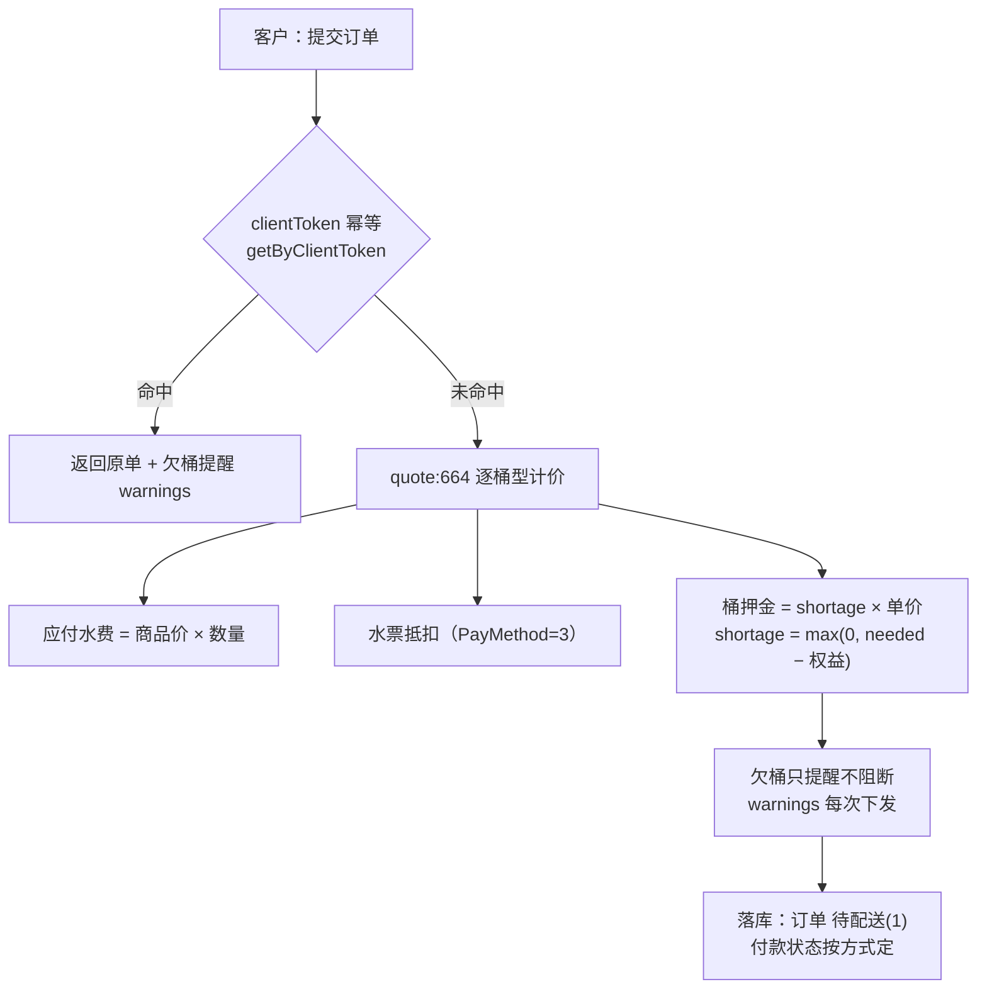
```mermaid
flowchart TD
  S["客户：提交订单"] --> ID{"clientToken 幂等<br/>getByClientToken"}
  ID -->|"命中"| IDR["返回原单 + 欠桶提醒 warnings"]
  ID -->|"未命中"| Q["quote:664 逐桶型计价"]
  Q --> R1["应付水费 = 商品价 × 数量"]
  Q --> R2["水票抵扣（PayMethod=3）"]
  Q --> R3["桶押金 = shortage × 单价<br/>shortage = max(0, needed − 权益)"]
  R3 --> W["欠桶只提醒不阻断<br/>warnings 每次下发"]
  W --> SV["落库：订单 待配送(1)<br/>付款状态按方式定"]
```

**文字流程**

1. **幂等先行**：先按 `clientToken` 查，命中就直接返回原单（并照样下发欠桶提醒）。
2. **计价 `quote`**：服务端推导，**客户端传的金额一律不可信**。
3. **桶抵扣只认「权益」**：`shortage = max(0, needed − 权益)`，逐桶型（A 水的多不能抵 B 水的欠）。
   **配送中的桶不参与抵扣、也不可退**（那批桶还没到手上）。
4. **押金方向**：首单权益 0 → 收满押金；复购权益够 → 押金 0（见 §4 首单口径）。
5. **欠桶只提醒、不阻断**：物理护栏仍是 `占用 = 权益 + over ≥ 0`。

**代码入口**：`OrderServiceImpl`（下单）、`PaymentServiceImpl#quote:664`、`PayMethod#availableMethods:55`。

---

## 4. 首单口径（两处合称，只看一个必错）

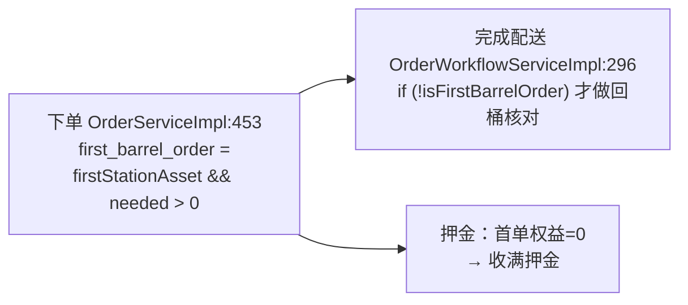
```mermaid
flowchart LR
  A["下单 OrderServiceImpl:453<br/>first_barrel_order =<br/>firstStationAsset && needed > 0"] --> B["完成配送 OrderWorkflowServiceImpl:296<br/>if (!isFirstBarrelOrder) 才做回桶核对"]
  A --> C["押金：首单权益=0<br/>→ 收满押金"]
```

| 处 | 位置 | 作用 |
|---|---|---|
| 写 | `OrderServiceImpl:453` | 本站第一笔**买桶**订单 → 标记首单 |
| 读 | `OrderWorkflowServiceImpl:296` | 为真则**整段跳过回桶核对** —— 客户刚买下桶、手上没空桶可还，回桶填 0 **不得**生成桶异常单 |
| 押金 | `quote` | 首单权益 0 → 收满；复购权益够 → 0 |

回归用例：`OrderEntryAndInjectionIntegrationTest`。

---

## 5. 支付与收款（三条支付线的全部差异）

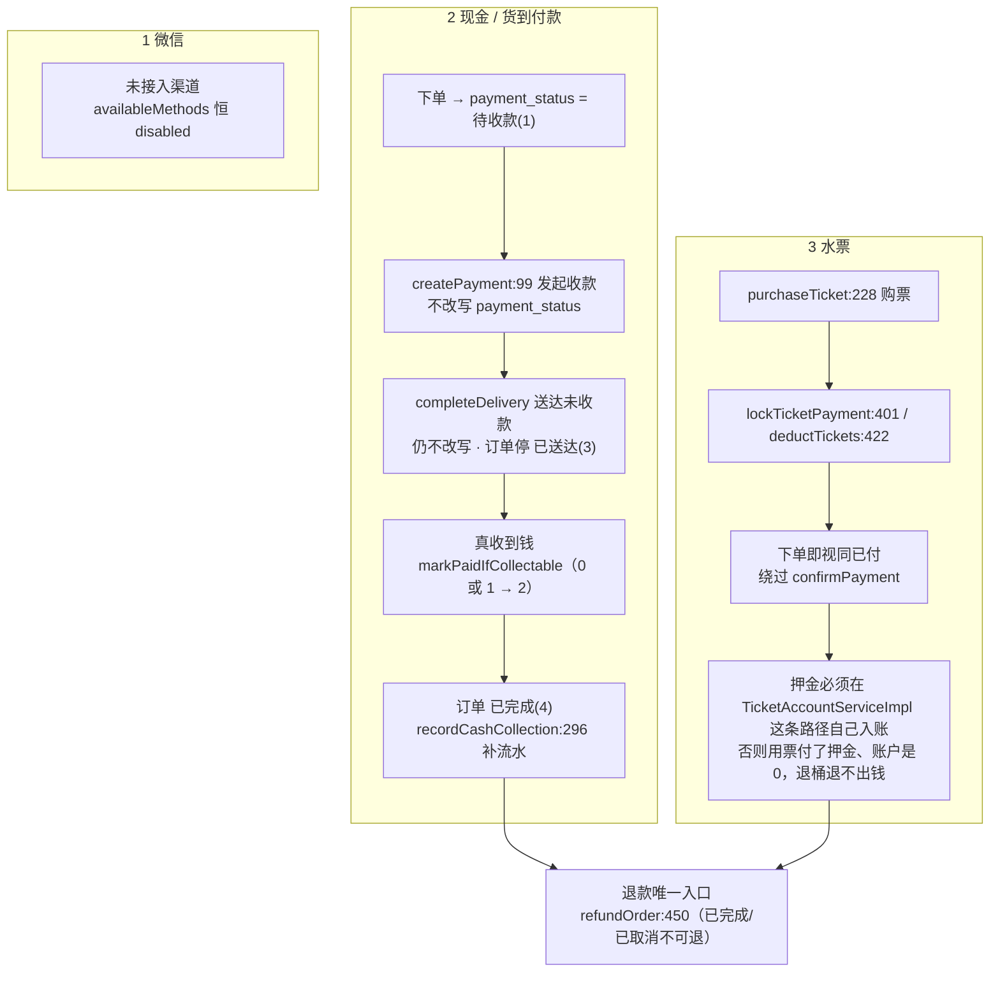
```mermaid
flowchart TD
  subgraph CASH["2 现金 / 货到付款"]
    A1["下单 → payment_status = 待收款(1)"] --> A2["createPayment:99 发起收款<br/>不改写 payment_status"]
    A2 --> A3["completeDelivery 送达未收款<br/>仍不改写 · 订单停 已送达(3)"]
    A3 --> A4["真收到钱<br/>markPaidIfCollectable（0 或 1 → 2）"]
    A4 --> A5["订单 已完成(4)<br/>recordCashCollection:296 补流水"]
  end
  subgraph TICKET["3 水票"]
    B1["purchaseTicket:228 购票"] --> B2["lockTicketPayment:401 / deductTickets:422"]
    B2 --> B3["下单即视同已付<br/>绕过 confirmPayment"]
    B3 --> B4["押金必须在 TicketAccountServiceImpl 这条路径自己入账<br/>否则用票付了押金、账户是 0，退桶退不出钱"]
  end
  subgraph WECHAT["1 微信"]
    C1["未接入渠道<br/>availableMethods 恒 disabled"]
  end
  A5 --> RF["退款唯一入口<br/>refundOrder:450（已完成/已取消不可退）"]
  B4 --> RF
```

**判据**
- **支付状态只前进、不倒滚**：`0 未付 / 1 待收款 / 2 已付 / 3 已退款 / 4 已取消`（`constant/PaymentStatus.java`）。
- 唯一写"已付"的入口是 `OrderMapper.markPaidIfCollectable`（从 0 或 1 迁入，**绝不复活 3/4**）。
- **禁止**再写 `updatePaymentStatusIf(..., UNPAID, PAID)` —— 现金单现值是 1，CAS 的 `expected=0` 恒不命中：**钱收了、单子永远停在待收款**。
- `PaymentRecordMapper.updateStatusIf` 参数顺序是 **`(id, 目标状态, 期望状态)`**，写反会恒命中 0 行且**静默不报错**。
- 水票**没有** `adjustment_id` 幂等键（`addTicket:52`），调整口径见 §8。

---

## 6. 派单与履约（双水站模型）

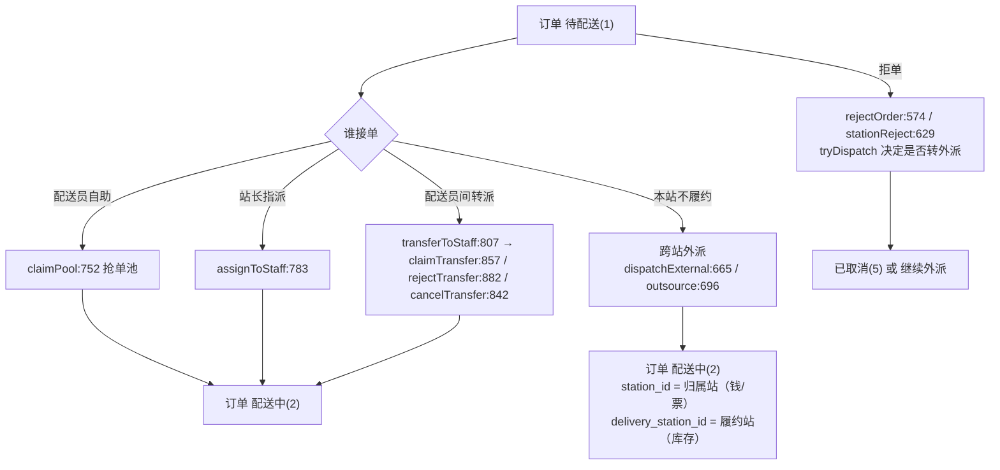
```mermaid
flowchart TD
  O["订单 待配送(1)"] --> M{"谁接单"}
  M -->|"配送员自助"| M1["claimPool:752 抢单池"]
  M -->|"站长指派"| M2["assignToStaff:783"]
  M -->|"配送员间转派"| M3["transferToStaff:807 → claimTransfer:857 / rejectTransfer:882 / cancelTransfer:842"]
  M -->|"本站不履约"| M4["跨站外派<br/>dispatchExternal:665 / outsource:696"]
  M1 --> G["订单 配送中(2)"]
  M2 --> G
  M3 --> G
  M4 --> G2["订单 配送中(2)<br/>station_id = 归属站（钱/票）<br/>delivery_station_id = 履约站（库存）"]
  O -->|"拒单"| J["rejectOrder:574 / stationReject:629<br/>tryDispatch 决定是否转外派"]
  J --> X["已取消(5) 或 继续外派"]
```

**一条铁律（跨站外派）**：`orders.station_id` = **交易/营收归属**，`orders.delivery_station_id` = **实际履约归属**。
跨站单取消时「**钱与票记归属站、库存回补记履约站**」；送达确认收款也只允许**归属站**做（§2 判据 2）。

**退回链路**（货物没送成，往回走）：`returnToStation:904`、`directedReturn:991` → `directedReturnApprove:1019` / `directedReturnReject:1040`。

---

## 7. 桶账四数模型（桶在系统里怎么流动）

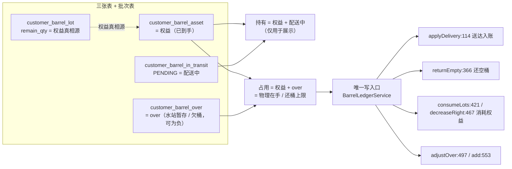
```mermaid
flowchart LR
  subgraph TABLES["三张表 + 批次表"]
    T1["customer_barrel_asset<br/>= 权益（已到手）"]
    T2["customer_barrel_in_transit<br/>PENDING = 配送中"]
    T3["customer_barrel_over<br/>= over（水站暂存 / 欠桶，可为负）"]
    T4["customer_barrel_lot<br/>remain_qty = 权益真相源"]
  end
  T1 --> E1["持有 = 权益 + 配送中<br/>（仅用于展示）"]
  T2 --> E1
  T1 --> E2["占用 = 权益 + over<br/>= 物理在手 / 还桶上限"]
  T3 --> E2
  T4 -.->|"权益真相源"| T1
  E2 --> U["唯一写入口<br/>BarrelLedgerService"]
  U --> W1["applyDelivery:114 送达入账"]
  U --> W2["returnEmpty:366 还空桶"]
  U --> W3["consumeLots:421 / decreaseRight:467 消耗权益"]
  U --> W4["adjustOver:497 / add:553"]
```

**文字版**

```
权益  = 已到手          customer_barrel_asset.quantity（送达时入账）
配送中 = in_transit PENDING
持有  = 权益 + 配送中    → 仅展示（"买了就是你的"）
占用  = 权益 + over      → 物理在手 / 还桶上限（不含配送中）

恒等式：占用 = 权益 + over
唯一写入口：BarrelLedgerService（别处直接写这三张表 = 绕开桶账）
```

**两条最容易犯的错（本仓各犯过多次）**

1. **任何"按商品/按桶型"的汇总必须取 `assets ∪ 配送中 ∪ over` 的并集** —— 只遍历 `assets`（它只记已到手的桶）
   会让"首单还在配送途中"的商品**整行消失**：概览写着"配送中 2"、明细一行都没有，连退桶弹窗都选不到那种桶。**已犯 4 次**。
2. **还桶上限一律用「占用」，不要用「持有」** —— 持有含配送中，会多报，提交后被后端以"交回数超过当前持有数"拒绝。

---

## 8. 退桶与退押金（欠桶互斥闸门）

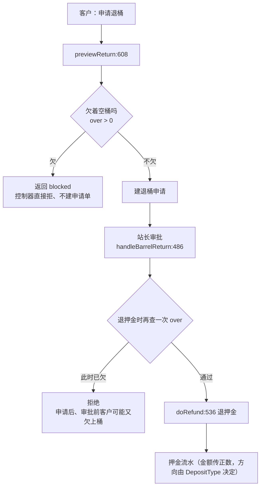
```mermaid
flowchart TD
  A["客户：申请退桶"] --> B["previewReturn:608"]
  B --> C{"欠着空桶吗<br/>over > 0"}
  C -->|"欠"| C1["返回 blocked<br/>控制器直接拒、不建申请单"]
  C -->|"不欠"| D["建退桶申请"]
  D --> E["站长审批<br/>handleBarrelReturn:486"]
  E --> F{"退押金时再查一次 over"}
  F -->|"此时已欠"| F1["拒绝<br/>申请后、审批前客户可能又欠上桶"]
  F -->|"通过"| G["doRefund:536 退押金"]
  G --> H["押金流水（金额传正数，方向由 DepositType 决定）"]
```

**判据**：**「欠着空桶就不许退桶，先还清」** —— 欠桶 = 客户手上端着比权益更多的桶，此时退押金等于桶在别人手里、担保物也没了。
按商品各算（A 水的多不能抵 B 水的欠）。回归用例 `BarrelReturnGuardIntegrationTest`。

⚠️ **已知绕开这道校验的两条通道**（只应由站长人工发起、且留调整单/异常单痕迹）：
`StationAdjustmentServiceImpl` 的撤桶权益走 `consumeLots` 直连；`OrderBarrelExceptionServiceImpl` 的异常单撤桶权益同理。
**不要给顾客或自动流程开这种口子。**

**欠桶台账**：`owed_since`（v29）只用于展示、不参与校验；唯一维护点 `CustomerBarrelOverMapper.syncOwedSince`。
站长端 `GET /api/manager/owed-barrels`；欠桶**只提醒不阻断**（硬拦已按产品决定移除）。

---

## 9. 桶异常单闭环（配送回桶对不上之后）

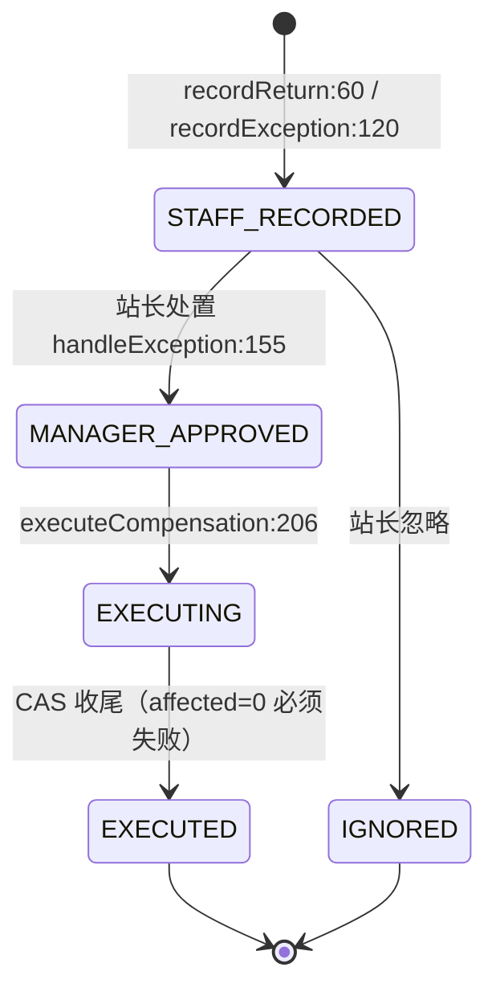
```mermaid
stateDiagram-v2
  [*] --> STAFF_RECORDED: recordReturn:60 / recordException:120
  STAFF_RECORDED --> MANAGER_APPROVED: 站长处置 handleException:155
  STAFF_RECORDED --> IGNORED: 站长忽略
  MANAGER_APPROVED --> EXECUTING: executeCompensation:206
  EXECUTING --> EXECUTED: CAS 收尾（affected=0 必须失败）
  EXECUTED --> [*]
  IGNORED --> [*]
```

| 状态 | 中文 | 谁 |
|---|---|---|
| `STAFF_RECORDED` | 待处理 | 配送员回桶时自动生成 |
| `MANAGER_APPROVED` / `IGNORED` | — | 站长决策（CAS：仅 `STAFF_RECORDED` 可写） |
| `EXECUTING` → `EXECUTED` | 已完成 | 补偿执行（退水票 / 退现金） |

**分类**：回桶少于应还 → `RETURN_SHORT`；多于应还 → `RETURN_OVER`（`:77`）；配送员也可自录分类（`:137`）。

**一条硬判据**：**"要求了补偿却没执行"也必须失败，不能标成 `EXECUTED`** ——
退水票分支若 `adjustProductId` 为空，旧代码只 `log.warn` 然后照样推到 `EXECUTED`：站长界面显示"已补偿"、客户水票一张没多。
现改为抛 `BusinessException`（事务回滚、退回 `STAFF_RECORDED` 可重试）。
**判据：任何"用户以为做成了、账上没动"的分支都算缺陷，宁可失败出声。**

---

## 10. 站长资产调整单（存量迁移 / 人工订正通道）

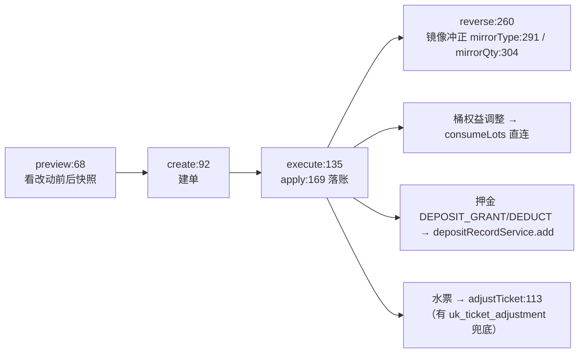
```mermaid
flowchart LR
  P["preview:68<br/>看改动前后快照"] --> C["create:92<br/>建单"]
  C --> E["execute:135<br/>apply:169 落账"]
  E --> R["reverse:260<br/>镜像冲正 mirrorType:291 / mirrorQty:304"]
  E --> B1["桶权益调整 → consumeLots 直连"]
  E --> B2["押金 DEPOSIT_GRANT/DEDUCT → depositRecordService.add"]
  E --> B3["水票 → adjustTicket:113（有 uk_ticket_adjustment 兜底）"]
```

**入口**：`/api/manager/adjustments`（6 端点，类级 `@RequireRole("STATION_MANAGER")`）。
**用途**：上线前水站用纸质台账经营，存量客户资产没有别的落点 —— **它是存量迁移的唯一通道**，
别用假订单或直接改余额列代替。

---

## 11. 对账与告警（账怎么对平、出问题通知谁）

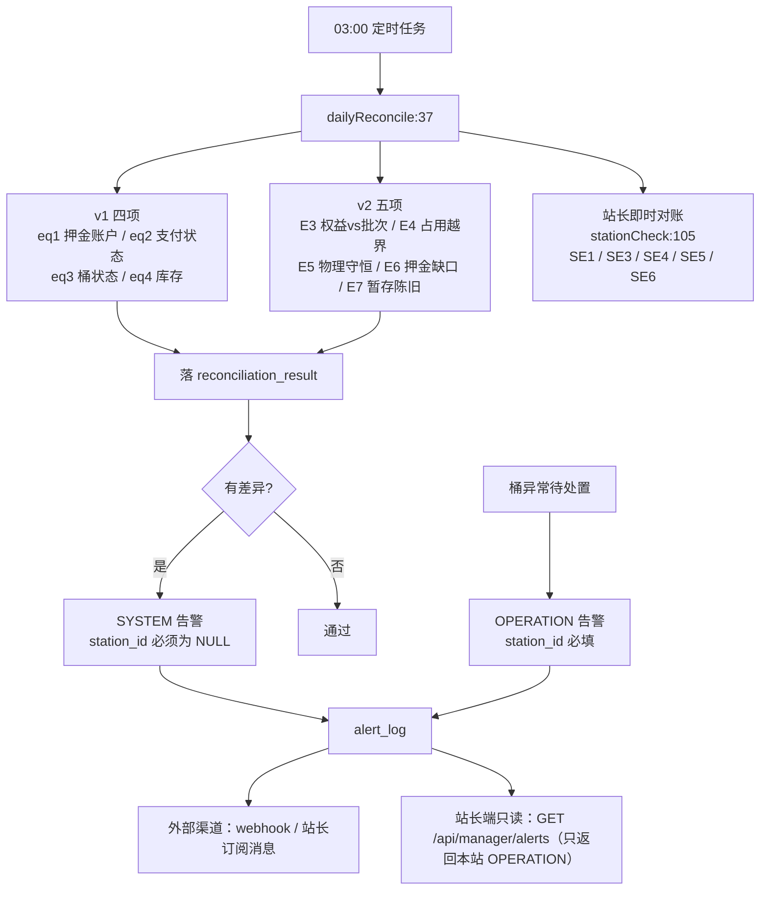
```mermaid
flowchart TD
  T["03:00 定时任务"] --> D["dailyReconcile:37"]
  D --> V1["v1 四项<br/>eq1 押金账户 / eq2 支付状态<br/>eq3 桶状态 / eq4 库存"]
  D --> V2["v2 五项<br/>E3 权益vs批次 / E4 占用越界<br/>E5 物理守恒 / E6 押金缺口 / E7 暂存陈旧"]
  D --> SE["站长即时对账<br/>stationCheck:105<br/>SE1 / SE3 / SE4 / SE5 / SE6"]
  V1 --> RS["落 reconciliation_result"]
  V2 --> RS
  RS --> Q{"有差异?"}
  Q -->|"是"| AL["SYSTEM 告警<br/>station_id 必须为 NULL"]
  Q -->|"否"| OK["通过"]
  AL --> L["alert_log"]
  EX["桶异常待处置"] --> AL2["OPERATION 告警<br/>station_id 必填"]
  AL2 --> L
  L --> N1["外部渠道：webhook / 站长订阅消息"]
  L --> N2["站长端只读：GET /api/manager/alerts（只返回本站 OPERATION）"]
```

**告警分级（产品口径）**

| 类型 | `station_id` | 什么算 | 发给谁 |
|---|---|---|---|
| `SYSTEM` | **必须 NULL** | 对账不平、桶异常补偿执行失败、未预期 500 | 系统管理员（站长看不懂也修不了） |
| `OPERATION` | **必填** | 桶异常待处置、补偿已执行、异常被忽略 | 该站站长 |

**三条硬约束**
1. **先落库再谈渠道** —— 外部渠道没配时 `notify_status=LOGGED`，"渠道没配"绝不等于"告警不存在"。
2. 落库走**独立事务**（`REQUIRES_NEW`，且必须经代理调用）—— 否则业务一回滚告警跟着消失，而告警最常见的触发场景恰恰是业务失败。
3. 落库/推送失败**绝不连累业务**（只记日志）。

**可见性红线**：系统告警**没有 HTTP 入口**（含平台级细节，漏给站长 = 跨租户 + 越权知情）。
运维直接 `select * from alert_log where alert_type='SYSTEM' order by id desc limit 50;`

---

## 12. 钱 / 水票 / 桶 —— 三条账线在流程哪一步动

| 流程节点 | 订单状态 | 钱（payment_record） | 水票（ticket_*） | 桶（桶账三表） |
|---|---|---|---|---|
| 下单 | 1 待配送 | 现金：待收款(1) | 水票：扣减 | 建配送中(PENDING)；算押金 |
| 接单/外派 | 2 配送中 | 不变 | 不变 | 不变 |
| 送达·已收款 | 4 已完成 | PAID 流水 + 押金入账 | — | **配送中 → 权益**（`applyDelivery`） |
| 送达·未收款 | 3 已送达 | 保持待收款(1) | — | 同上（权益已入账） |
| 确认收款 | 3 → 4 | PAID 流水 | — | 不变 |
| 还空桶 | — | — | — | `returnEmpty`：权益 −，over + |
| 退桶退押金 | — | 押金退款流水 | — | 权益 −，`doRefund` |
| 回桶对不上 | — | 可能退现金 | 可能退票 | 异常单挂账，站长处置 |
| 取消/拒单 | 5 已取消 | 退款（`refundOrder`） | 回补 | 库存回补走**履约站** |
| 人工订正 | — | 调整单流水 | `adjustTicket` | `consumeLots` 直连 + 调整单痕迹 |

---

## 13. 角色 × 流程 权限矩阵

| 流程节点 | 客户 | 配送员 | 站长 | 系统管理员 |
|---|---|---|---|---|
| 下单 / 取消申请 | ✅ | — | — | — |
| 地址簿 / 常用模板 / 通知 | ✅ | — | — | — |
| 接单 / 抢单 / 转派 | — | ✅ | ✅ | — |
| 送达 / 回桶录入 / 录异常 | — | ✅ | ✅ | — |
| **确认收款** | — | — | ✅（**跨站单仅归属站**） | — |
| 退桶审批 / 退押金 | 只能申请 | — | ✅ | — |
| 桶异常处置与补偿 | 只读自己 | 只报 | ✅ | — |
| 资产调整单 | — | — | ✅ | — |
| 对账（即时） | — | — | ✅ 只读本站 | — |
| 对账（全平台）/ 系统告警 | — | — | ❌ 不可见 | ✅ 直连 DB |

---

## 14. 流程节点 ↔ 已知坑 对照（改哪一段先看哪条）

| 流程节点 | 已知坑 | 在 `AGENTS.md` |
|---|---|---|
| 送达判定 / 请求体 | 裸 `Map` 收敛成 DTO 时**静默丢字段**（`collected`/`note`）→ 点「已收款」被当未收款，钱不入账 | §8.15 |
| 送达未收款 | `payment_status` 倒回 0 → 应收从站长「待收款」合计消失 | §1 支付状态只前进 |
| 确认收款 | `updatePaymentStatusIf(..., UNPAID, PAID)` 恒不命中：钱收了、单永远待收款 | §1 |
| 任何 CAS 写状态 | `PaymentRecordMapper.updateStatusIf` 参数是 `(id, 目标, 期望)`，写反**静默不变** | §1 |
| 跨站外派 | 钱货分家：钱/票记归属站、库存回补记履约站 | §8.3 |
| 取消退款 | 唯一入口 `refundOrder`；已完成/已取消**不可**再取消 | §1、§8.18 |
| 水票下单 | 绕过 `confirmPayment` → 押金必须在票路径自己入账 | §8.4 |
| 按商品聚合桶 | 只遍历 `assets` → 整行消失（**惯犯，第 4 次**） | §1、§8.16 |
| 还桶上限 | 用「持有」而非「占用」→ 多报被拒 | §1 |
| 退桶 | 欠桶仍然退押金 → 桶在别人手里、担保物也没了 | §1 |
| 异常单补偿 | 要求了补偿却没执行，仍标 `EXECUTED` | §8.17 |
| 站长看板统计 | `<= 当天` 漏一整天 → 看板永远停在昨天、显示"无异常" | §8.19 |
| 地址簿 / 模板 | 按 id 操作不验归属、不看受影响行数 | §8.20 |
| 文件上传 | 外部依赖没配 → 500（应为业务错误 `code=1`） | §8.21 |
| 对账 / 真实库 | 唯一键漂移 → 测试全绿但真实库报 1062 | §8.12 |

---

## 15. 怎么维护这张图

1. **改流程先改图**：动 `OrderStatus` 流转、支付口径、桶账口径、告警分级任一处，回来改对应那张图与表。
2. **图的每个节点都带代码入口**（`类#方法:行`）—— 行号会漂，改代码时顺手同步；图与代码冲突**以代码为准**。
3. 新增业务流转时，**先问它属于哪条账线**（钱 / 票 / 桶），再决定挂在 §12 哪一行。
4. 这份图**不复制领域口径** —— 口径的正本在 `AGENTS.md` §1 与 `constant/*.java`，这里只画"经过谁、先后顺序"。
